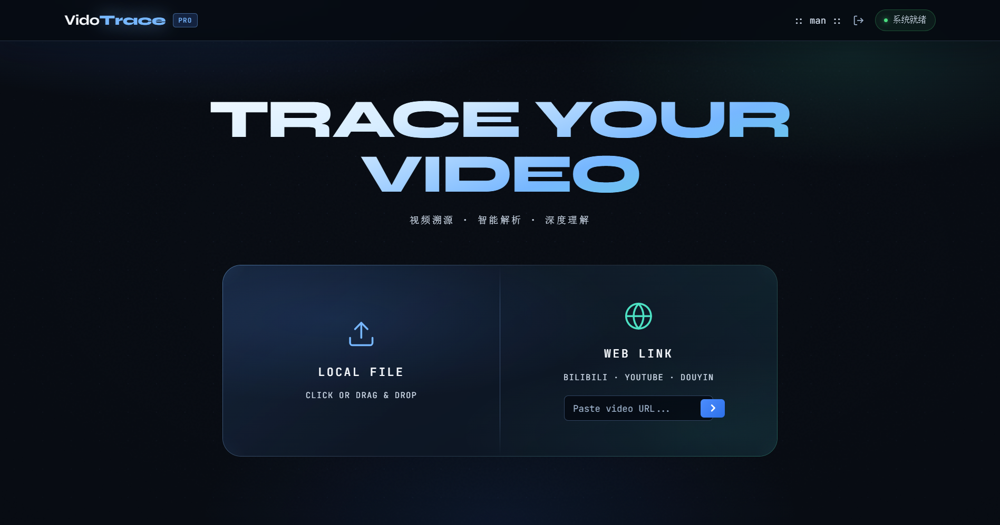
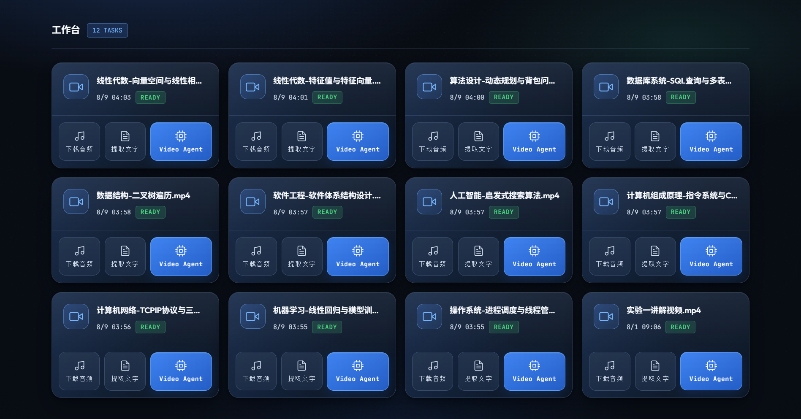
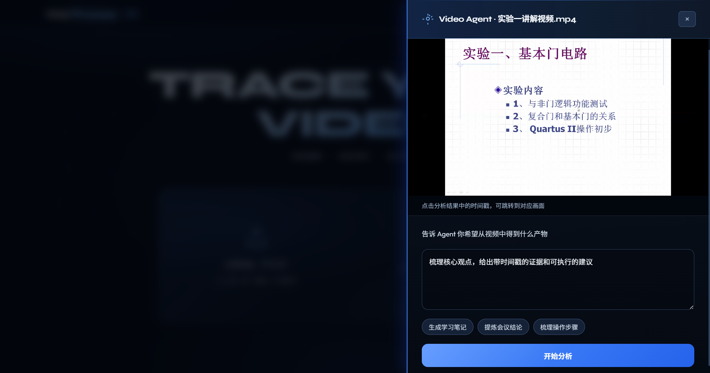
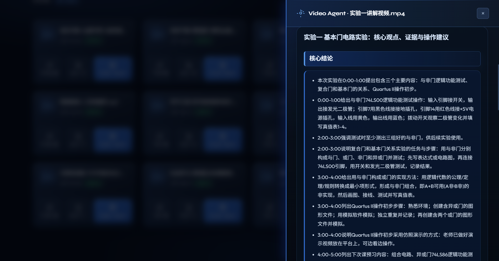
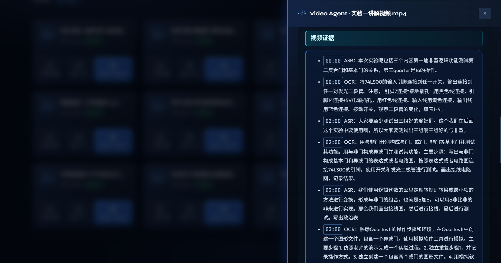

<h1 align="center">VidoTrace</h1>

<p align="center">
  
  
  
  
  
  
  
  

</p>

<p align="center"><a href="https://videotrace.online/">在线体验：videotrace.online</a></p>

<p align="center">面向长视频内容解析理解的智能分析平台。</p>

<p align="center">让长视频内容可检索、可理解、可追溯，每条分析结论都能定位到原视频。</p>

---

## 项目预览

### 首页



### 视频工作台



### 任务输入



### 分析结果





## 安装

以下步骤适用于 Linux。本地运行使用 Docker Compose 构建并启动各服务，无需在宿主机单独安装 Node.js、Java、MySQL、Redis、PostgreSQL 或 RocketMQ。

1. 安装 Git、Docker Engine 和 Docker Compose 插件，并确认 Docker 服务正在运行。
2. 检查安装：

   ```bash
   git --version
   docker --version
   docker compose version
   ```

3. 克隆仓库并创建本地配置文件：

   ```bash
   git clone https://github.com/maple0leaves/VideoTrace.git
   cd VideoTrace
   cp .env.example .env
   ```

4. 编辑 `.env`，将 `VIDEOTRACE_DEEPSEEK_API_KEY` 和 `SILICONFLOW_API_KEY` 替换为真实的 API Key。前者用于主要聊天模型；后者用于备用聊天模型、Embedding 和语音识别。运行容器的主机需要能访问对应服务。

   还需要将以下密码占位符替换为**各自不同的随机值**：

   | 配置项 | 用途 |
   | --- | --- |
   | `MYSQL_ROOT_PASSWORD` | MySQL 管理员密码 |
   | `DB_PASSWORD` | 应用连接 MySQL 的密码 |
   | `REDIS_PASSWORD` | Redis 访问密码 |
   | `VECTOR_DB_PASSWORD` | pgvector 数据库密码 |
   | `MINIO_SECRET_KEY` | MinIO 对象存储密码 |

   可以在 Linux 上用 OpenSSL 生成五个值：

   ```bash
   for name in MYSQL_ROOT_PASSWORD DB_PASSWORD REDIS_PASSWORD VECTOR_DB_PASSWORD MINIO_SECRET_KEY; do
     printf '%s=' "$name"
     openssl rand -hex 32
   done
   ```

   将输出的五行分别替换 `.env` 中对应的行。如果通过其他主机或自定义端口访问，还应将 `PUBLIC_ORIGIN` 改为浏览器实际访问的地址（例如 `http://192.0.2.10:8080`），并按需设置 `HTTP_PORT`。

## 快速开始

完成安装和 `.env` 配置后，在仓库根目录运行：

```bash
docker compose --env-file .env up -d --build
docker compose --env-file .env ps
```

Docker Compose 使用 [`docker-compose.yml`](docker-compose.yml) 启动 React 前端、Spring Boot 后端，以及 MySQL、Redis、pgvector、MinIO 和 RocketMQ。首次构建需要下载镜像与依赖，请等待服务通过健康检查。

默认在本机打开 <http://localhost>。注册账号后，工作台会提供一段示例视频；也可以上传本地视频或粘贴视频链接，再输入分析目标并开始分析。视频和数据库数据保存在 `.env` 中 `VIDEOTRACE_DATA_DIR` 指定的目录，样例配置为项目下的 `./data`。

停止服务可运行 `docker compose --env-file .env down`；该命令不会删除上述数据目录。

## 核心功能

- **视频导入与管理**：分片上传本地视频，或通过网页链接导入视频；在个人工作台查看和删除视频。
- **音频与文字提取**：下载视频音频，按需进行语音转写，并查看转写结果。
- **目标驱动智能分析**：输入分析目标后，系统结合语音转写、关键帧 OCR 和相关片段检索生成分析结果，并显示任务进度。
- **证据定位与交互**：点击结果中的时间戳跳转到原视频，检索视频证据，继续追问、调整分析计划或提交结果反馈。

## 目录

```text
VideoTrace/
├── client/                       # React 前端与 Nginx 配置
├── server/                       # Spring Boot API、视频处理与分析
├── rocketmq/                     # RocketMQ Broker 配置
├── deploy/scripts/               # 生产部署检查脚本
├── docs/images/                  # 项目截图
├── .github/workflows/            # CI 工作流
├── docker-compose.yml            # 本地完整服务编排
├── docker-compose.prod.yml       # 生产环境应用编排
├── .env.example                  # 本地环境变量模板
├── .env.production.example       # 生产环境变量模板
└── LICENSE                       # MIT 许可证
```

## License

本项目采用 [MIT License](LICENSE)。
